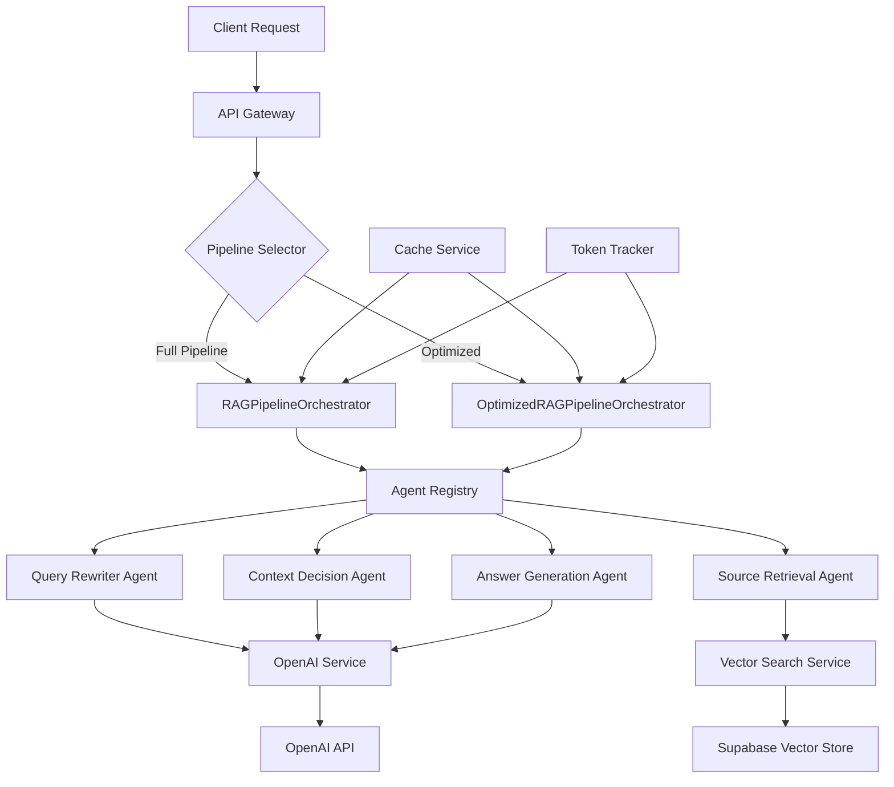

# RAG System Technical Documentation

## Table of Contents

1. [System Overview](#system-overview)
2. [Architecture](#architecture)
3. [Pipeline Flow](#pipeline-flow)
4. [API Implementation](#api-implementation)
5. [Agent Architecture](#agent-architecture)
6. [Data Models](#data-models)
7. [Performance Optimizations](#performance-optimizations)
8. [Error Handling](#error-handling)
9. [Deployment & Scaling](#deployment--scaling)
10. [Testing Strategy](#testing-strategy)

## System Overview

The Agentic RAG (Retrieval-Augmented Generation) system is a sophisticated multi-agent architecture designed to process user queries through a comprehensive pipeline that combines query optimization, intelligent context retrieval, and AI-powered response generation.

### Key Features

- **Dual Pipeline Architecture**: Full pipeline for maximum accuracy, optimized pipeline for 60-70% cost reduction
- **4-Stage Processing**: Query Rewriting → Context Decision → Source Retrieval → Answer Generation
- **Real-time Streaming**: WebSocket and Server-Sent Events support
- **Smart Caching**: Multi-level caching with 24-hour TTL
- **Cost Optimization**: Intelligent model selection and pattern matching
- **Comprehensive Monitoring**: Performance metrics and token tracking

### Pipeline Variants

#### 1. RAGPipelineOrchestrator (Full Pipeline)

- Complete 4-stage processing
- Maximum accuracy and comprehensive analysis
- Full agent utilization
- Endpoint: `/api/v1/rag/process/full`

#### 2. OptimizedRAGPipelineOrchestrator (Cost-Efficient)

- 60-70% cost reduction while maintaining quality
- Smart model selection (GPT-3.5 vs GPT-4)
- Aggressive caching strategy
- Pattern matching for simple queries
- Endpoint: `/api/v1/rag/process` (default)

## Architecture



### Core Components

1. **Pipeline Orchestrators**: Central coordination systems
2. **Agent Registry**: Manages agent lifecycle and dependencies
3. **Agent Framework**: Individual processing agents with standardized interfaces
4. **Services Layer**: OpenAI integration, vector search, caching
5. **Data Layer**: Supabase for embeddings and document storage

## Pipeline Flow

### Stage 1: Query Rewriting Agent

**Purpose**: Optimize and normalize user queries for better retrieval

**Process**:

1. Analyze query structure and intent
2. Expand abbreviations and normalize terminology
3. Integrate conversation context
4. Enhance semantic clarity

**Example Input/Output**:

```
Input: "ML benefits?"
Output: "What are the benefits of using machine learning in business applications?"
```

### Stage 2: Context Decision Agent

**Purpose**: Determine if external context retrieval is necessary

**Strategies**:

- **Pattern Matching**: Quick decisions for simple queries
- **Conversation Analysis**: Check if context exists in chat history
- **AI Assessment**: GPT-based complexity evaluation

**Decision Logic**:

```python
if simple_greeting_pattern(query):
    return False  # No context needed
elif context_in_conversation(query, history):
    return False  # Use conversation context
else:
    return ai_assessment(query)  # Let AI decide
```

### Stage 3: Source Retrieval Agent

**Purpose**: Retrieve relevant documents from vector store

**Retrieval Strategies**:

1. **Semantic Search**: Vector similarity using embeddings
2. **Keyword Search**: Traditional text matching
3. **Hybrid Approach**: Combines semantic + keyword
4. **Adaptive Strategy**: Selects best approach based on query type

**Implementation**:

```python
async def retrieve_sources(self, query: str, strategy: str = "adaptive"):
    if strategy == "adaptive":
        strategy = self._select_optimal_strategy(query)

    if strategy == "semantic":
        return await self._semantic_search(query)
    elif strategy == "hybrid":
        semantic_results = await self._semantic_search(query)
        keyword_results = await self._keyword_search(query)
        return self._merge_results(semantic_results, keyword_results)
```

### Stage 4: Answer Generation Agent

**Purpose**: Generate comprehensive responses with citations

**Features**:

- **Model Selection**: GPT-3.5-turbo vs GPT-4-turbo based on complexity
- **Citation Integration**: Automatic source referencing
- **Quality Assessment**: Response quality scoring
- **Format Conversion**: Markdown, HTML, plain text support
- **Streaming Support**: Real-time response generation

## API Implementation

### REST Endpoints

#### Process RAG Query (Optimized)

```http
POST /api/v1/rag/process
Content-Type: application/json

{
  "query": "What are the benefits of microservices architecture?",
  "conversation_history": [
    {"role": "user", "content": "Tell me about software architecture"},
    {"role": "assistant", "content": "Software architecture defines..."}
  ],
  "user_context": {
    "domain": "software_engineering",
    "experience_level": "intermediate"
  },
  "pipeline_config": {
    "max_sources": 5,
    "similarity_threshold": 0.8
  }
}
```

**Response**:

```json
{
  "request_id": "uuid-123",
  "query": "What are the benefits of microservices architecture?",
  "status": "completed",
  "pipeline_type": "optimized",
  "final_response": {
    "query": "What are the benefits of microservices architecture?",
    "response": {
      "content": "Microservices architecture offers several key benefits...",
      "citations": [
        {
          "id": 1,
          "text": "According to the architecture guide...",
          "source": "microservices-guide.pdf",
          "page": 15
        }
      ],
      "format_type": "markdown"
    }
  },
  "stage_results": {
    "query_rewriting": {
      "rewritten_query": "What are the benefits of microservices architecture?",
      "duration": 0.234
    },
    "context_decision": {
      "context_needed": true,
      "confidence": 0.95,
      "duration": 0.145
    },
    "source_retrieval": {
      "sources_count": 5,
      "strategy_used": "semantic",
      "duration": 1.234
    },
    "answer_generation": {
      "response_length": 1456,
      "citations_count": 3,
      "duration": 2.567
    }
  },
  "total_duration": 4.18,
  "optimization_info": {
    "pipeline_used": "optimized",
    "cost_saved": 0.045,
    "optimizations_applied": ["smart_caching", "model_optimization"]
  }
}
```

#### Streaming Endpoints

**Server-Sent Events**:

```http
POST /api/v1/rag/stream
```

**WebSocket**:

```javascript
const ws = new WebSocket("ws://localhost:8000/api/v1/rag/stream-ws");
ws.send(
  JSON.stringify({
    query: "What is deep learning?",
    conversation_history: [],
  })
);

ws.onmessage = (event) => {
  const update = JSON.parse(event.data);
  console.log(`Stage: ${update.stage}, Status: ${update.status}`);
};
```

#### Monitoring Endpoints

**Pipeline Status**:

```http
GET /api/v1/rag/status
```

**Performance Metrics**:

```http
GET /api/v1/rag/metrics
```

## Agent Architecture

### BaseAgent Pattern

All agents inherit from a standardized base class providing:

```python
class BaseAgent(ABC):
    def __init__(self, agent_id: str, config: Dict[str, Any]):
        self.agent_id = agent_id
        self.config = config
        self.is_running = False
        self.metrics = AgentMetrics()

    @abstractmethod
    async def process(self, data: Dict[str, Any]) -> AgentResult:
        """Process input data and return result"""
        pass

    async def start(self) -> None:
        """Start the agent"""
        self.is_running = True

    async def stop(self) -> None:
        """Stop the agent"""
        self.is_running = False
```

### Agent Registry

Centralized agent management with dependency injection:

```python
class AgentRegistry:
    def __init__(self):
        self._agents: Dict[str, BaseAgent] = {}
        self._agent_types: Dict[str, type] = {}

    async def create_agent(
        self,
        agent_type: str,
        config: Dict[str, Any],
        auto_start: bool = True
    ) -> BaseAgent:
        """Create and register a new agent"""

    def get_agents_by_type(self, agent_type: str) -> List[BaseAgent]:
        """Get all agents of a specific type"""
```

### Agent Implementations

#### Query Rewriting Agent

- **Input**: Original query + conversation history
- **Output**: Optimized query string
- **Features**: Context integration, terminology normalization

#### Context Decision Agent

- **Input**: Query + conversation history
- **Output**: Boolean decision + confidence score
- **Features**: Pattern matching, AI assessment, conversation analysis

#### Source Retrieval Agent

- **Input**: Query + retrieval parameters
- **Output**: List of relevant documents
- **Features**: Multiple search strategies, result ranking

#### Answer Generation Agent

- **Input**: Query + sources + conversation history
- **Output**: Generated response with citations
- **Features**: Model selection, streaming, quality assessment

## Data Models

### Request Models

```python
class RAGRequest(BaseModel):
    query: str = Field(..., min_length=1, max_length=2000)
    conversation_history: Optional[List[Dict[str, Any]]] = None
    user_context: Optional[Dict[str, Any]] = None
    pipeline_config: Optional[Dict[str, Any]] = None
```

### Response Models

```python
class ProcessingResult(BaseModel):
    request_id: str
    query: str
    status: str
    pipeline_type: str
    final_response: Optional[Dict[str, Any]]
    stage_results: Dict[str, Any]
    total_duration: float
    optimization_info: Optional[Dict[str, Any]]
```

### Internal Models

```python
class AgentResult(BaseModel):
    success: bool
    data: Dict[str, Any]
    error: Optional[str]
    metadata: Dict[str, Any]
    duration: float
```

## Performance Optimizations

### 1. Aggressive Caching (24-hour TTL)

```python
def _generate_cache_key(
    self,
    query: str,
    conversation_history: Optional[List[Dict[str, Any]]]
) -> str:
    cache_data = {
        "query": query.lower().strip(),
        "history": conversation_history or []
    }
    return hashlib.md5(json.dumps(cache_data, sort_keys=True).encode()).hexdigest()
```

### 2. Smart Model Selection

```python
def _should_use_advanced_model(
    self,
    query: str,
    conversation_history: Optional[List[Dict[str, Any]]]
) -> bool:
    # Complex queries get GPT-4, simple ones get GPT-3.5
    complexity_indicators = [
        'analyze', 'compare', 'explain why', 'how does',
        'relationship between', 'advantages and disadvantages'
    ]

    query_lower = query.lower()
    has_complexity = any(indicator in query_lower for indicator in complexity_indicators)
    has_context = conversation_history and len(conversation_history) > 2

    return has_complexity or has_context or len(query.split()) > 15
```

### 3. Multi-Level Caching Strategy

- **Pipeline Results**: Full response caching (24h TTL)
- **Agent Results**: Individual agent outputs (1h TTL)
- **Embeddings**: Vector representations (persistent)
- **Source Results**: Retrieved documents (6h TTL)

### 4. Pattern Matching for Simple Queries

```python
def _handle_non_informational_patterns(self, query: str) -> Optional[Dict[str, Any]]:
    greeting_patterns = [
        r'^(hello|hi|hey|good morning|good afternoon|good evening)',
        r'^(thank you|thanks|thx)',
        r'^(bye|goodbye|see you)'
    ]

    query_lower = query.lower().strip()
    for pattern in greeting_patterns:
        if re.match(pattern, query_lower):
            return self._generate_simple_response(query)

    return None
```

## Error Handling

### Fallback Strategies

Each agent implements fallback mechanisms:

1. **Query Rewriter**: Return original query on failure
2. **Context Decision**: Default to requiring context
3. **Source Retrieval**: Return empty sources list
4. **Answer Generation**: Provide generic helpful response

### Error Response Format

```python
ProcessingResult(
    request_id=request_id,
    query=request.query,
    status="failed",
    pipeline_type="optimized",
    final_response={
        "query": request.query,
        "response": {
            "content": f"I apologize, but I encountered an error: {error_msg}",
            "citations": [],
            "format_type": "markdown"
        }
    },
    stage_results={"error": error_msg},
    total_duration=processing_time,
    optimization_info={"pipeline_used": "optimized", "error": True}
)
```

### Retry Logic

```python
async def _execute_with_retry(self, operation, max_retries=3):
    for attempt in range(max_retries):
        try:
            return await operation()
        except Exception as e:
            if attempt == max_retries - 1:
                raise e
            wait_time = 2 ** attempt  # Exponential backoff
            await asyncio.sleep(wait_time)
```

## Deployment & Scaling

### Docker Configuration

```dockerfile
FROM python:3.11-slim

WORKDIR /app

COPY requirements.txt .
RUN pip install -r requirements.txt

COPY . .

EXPOSE 8000

CMD ["uvicorn", "app.main:app", "--host", "0.0.0.0", "--port", "8000"]
```

### Kubernetes Deployment

```yaml
apiVersion: apps/v1
kind: Deployment
metadata:
  name: rag-backend
spec:
  replicas: 3
  selector:
    matchLabels:
      app: rag-backend
  template:
    metadata:
      labels:
        app: rag-backend
    spec:
      containers:
        - name: rag-backend
          image: rag-backend:latest
          ports:
            - containerPort: 8000
          env:
            - name: OPENAI_API_KEY
              valueFrom:
                secretKeyRef:
                  name: api-keys
                  key: openai-key
          resources:
            requests:
              memory: "512Mi"
              cpu: "250m"
            limits:
              memory: "2Gi"
              cpu: "1000m"
```

### Horizontal Scaling

The system supports horizontal scaling through:

- **Stateless agents**: All agents are stateless and can be distributed
- **Shared cache**: Redis for distributed caching
- **Load balancing**: Multiple pipeline orchestrator instances
- **Database pooling**: Connection pooling for Supabase

### Health Checks

```python
@router.get("/health")
async def health_check():
    return {
        "status": "healthy",
        "timestamp": datetime.utcnow(),
        "version": "1.0.0",
        "agents": {
            "query_rewriter": "running",
            "context_decision": "running",
            "source_retrieval": "running",
            "answer_generation": "running"
        }
    }
```

## Testing Strategy

### Unit Tests

Each agent includes comprehensive unit tests:

```python
class TestQueryRewritingAgent:
    async def test_basic_query_rewriting(self):
        agent = QueryRewritingAgent("test-id", {})
        result = await agent.process({
            "query": "ML benefits?",
            "conversation_history": []
        })
        assert result.success
        assert "machine learning" in result.data["rewritten_query"].lower()
```

### Integration Tests

Full pipeline testing:

```python
class TestRAGPipeline:
    async def test_end_to_end_processing(self):
        orchestrator = RAGPipelineOrchestrator(registry, metrics)
        result = await orchestrator.process_query(
            query="What is deep learning?",
            conversation_history=[],
            user_context={},
            pipeline_config={}
        )
        assert result.status == "completed"
        assert result.final_response is not None
```

### Performance Tests

Load testing with concurrent requests:

```python
async def test_concurrent_processing(self):
    tasks = []
    for i in range(10):
        task = orchestrator.process_query(f"Test query {i}")
        tasks.append(task)

    results = await asyncio.gather(*tasks)
    successful = sum(1 for r in results if r.status == "completed")
    assert successful >= 8  # Allow for some failures
```

### Monitoring & Metrics

Comprehensive tracking includes:

- **Request volume**: Total and per-endpoint metrics
- **Response times**: Per-stage and total pipeline duration
- **Success rates**: Pipeline and individual agent success rates
- **Cost tracking**: Token usage and associated costs
- **Cache performance**: Hit rates and efficiency metrics
- **Error tracking**: Failure patterns and error categorization

### Usage Examples

#### Basic Query Processing

```python
# Using the optimized pipeline (default)
request = RAGRequest(
    query="What are the benefits of microservices?",
    conversation_history=[],
    user_context={"domain": "software_engineering"}
)

response = await optimized_orchestrator.process_query(request)
print(f"Response: {response.final_response['response']['content']}")
print(f"Sources used: {len(response.final_response['response']['citations'])}")
```

#### Streaming Implementation

```python
async def stream_example():
    async for update in orchestrator.stream_query(
        query="Explain machine learning",
        conversation_history=[]
    ):
        print(f"Stage: {update['stage']}, Status: {update['status']}")
        if update.get('final_response'):
            print(f"Final: {update['final_response']}")
```

### Future Enhancements

1. **Multi-modal Support**: Image and document upload processing
2. **Advanced Caching**: Semantic cache based on query similarity
3. **Personalization**: User-specific optimization and preferences
4. **Analytics Dashboard**: Real-time monitoring and insights
5. **A/B Testing**: Pipeline variant performance comparison
6. **Custom Agents**: User-defined processing agents
7. **Federation**: Multi-source knowledge integration

This technical documentation provides a comprehensive overview of the RAG system architecture, implementation details, and operational considerations. The system demonstrates enterprise-grade capabilities with robust error handling, performance optimization, and scalability features.
