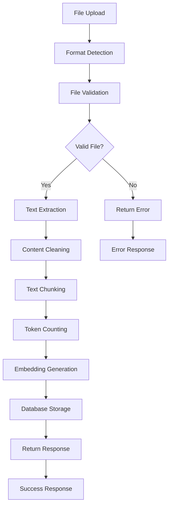

# Document Processing System Overview

## 🎯 Overview

The Document Processing System is a comprehensive pipeline for uploading, processing, and managing documents in the Agentic RAG AI Agent backend. It provides multi-format document support, intelligent text extraction, chunking, embedding generation, and semantic search capabilities.

## 🏗️ System Architecture

### Core Components

```
┌─────────────────┐    ┌──────────────────┐    ┌─────────────────┐
│   API Layer     │    │  Processing Core │    │   Data Layer    │
│                 │    │                  │    │                 │
│ • Upload API    │───▶│ • Document       │───▶│ • Supabase DB   │
│ • Search API    │    │   Processor      │    │ • Vector Store  │
│ • Management    │    │ • Text Extractor │    │ • Embeddings    │
│   API           │    │ • Chunking       │    │                 │
└─────────────────┘    └──────────────────┘    └─────────────────┘
         │                       │                       │
         │                       │                       │
         ▼                       ▼                       ▼
┌─────────────────┐    ┌──────────────────┐    ┌─────────────────┐
│   Services      │    │   File Support   │    │   External      │
│                 │    │                  │    │                 │
│ • Document      │    │ • PDF Reader     │    │ • OpenAI API    │
│   Service       │    │ • DOCX Parser    │    │ • Embedding     │
│ • OpenAI        │    │ • HTML Parser    │    │   Models        │
│   Service       │    │ • Text Detector  │    │                 │
│ • Vector Search │    │ • Validation     │    │                 │
└─────────────────┘    └──────────────────┘    └─────────────────┘
```

### Document Processing Pipeline

The system follows a 5-stage processing pipeline:

1. **File Upload & Validation**: Multi-format file support with comprehensive validation
2. **Text Extraction**: Format-specific content extraction with metadata preservation
3. **Intelligent Chunking**: Smart text segmentation with configurable overlap
4. **Embedding Generation**: Vector embeddings using OpenAI's text-embedding-ada-002
5. **Database Storage**: Structured storage in Supabase with optimized vector search

## 🔄 Document Processing Flow

### High-Level Process



### Processing Stages in Detail

#### Stage 1: File Upload & Validation

- **Purpose**: Receive and validate uploaded files
- **Process**:
  - MIME type detection
  - File size validation
  - Format support verification
  - Content integrity checks

#### Stage 2: Text Extraction

- **Purpose**: Extract text content from various file formats
- **Process**:
  - Format-specific parsing
  - Encoding detection and handling
  - Metadata extraction
  - Content structure preservation

#### Stage 3: Intelligent Chunking

- **Purpose**: Segment text into manageable chunks for processing
- **Process**:
  - Token-based chunking with configurable size
  - Overlap management for context preservation
  - Boundary detection (sentences, paragraphs)
  - Chunk metadata generation

#### Stage 4: Embedding Generation

- **Purpose**: Generate vector embeddings for semantic search
- **Process**:
  - Batch processing for efficiency
  - OpenAI API integration
  - Vector validation and storage
  - Cost optimization strategies

#### Stage 5: Database Storage

- **Purpose**: Store documents and embeddings in structured format
- **Process**:
  - Document metadata storage
  - Chunk and embedding insertion
  - Relationship management
  - Search index optimization

## 📊 Supported File Formats

### Primary Formats

| Format       | Extension | Features                              | Limitations                           |
| ------------ | --------- | ------------------------------------- | ------------------------------------- |
| **PDF**      | `.pdf`    | Text extraction, metadata, multi-page | Complex layouts may affect extraction |
| **DOCX**     | `.docx`   | Full text, formatting metadata        | Images and complex objects ignored    |
| **TXT**      | `.txt`    | Plain text, encoding detection        | No metadata extraction                |
| **HTML**     | `.html`   | Tag removal, content extraction       | Complex CSS layouts may be lost       |
| **Markdown** | `.md`     | Structure preservation                | Limited metadata                      |
| **CSV**      | `.csv`    | Structured data handling              | Requires special processing           |

### Format-Specific Processing

#### PDF Processing

```python
# Advanced PDF text extraction
- PyPDF2 for standard text extraction
- Encoding detection and handling
- Page-by-page processing
- Metadata extraction (author, title, etc.)
- Error recovery for corrupted files
```

#### DOCX Processing

```python
# Microsoft Word document handling
- python-docx for content extraction
- Paragraph and section preservation
- Style and formatting metadata
- Table content extraction
- Header and footer handling
```

#### HTML Processing

```python
# Web content extraction
- BeautifulSoup for tag removal
- Content structure preservation
- Link and media metadata extraction
- Character encoding handling
- Clean text output
```

## 🔧 Core Services

### Document Processor (`services/document_processor.py`)

**Purpose**: Core text extraction and chunking service

**Key Features**:

- **Multi-format Support**: PDF, DOCX, TXT, HTML, MD, CSV
- **Intelligent Chunking**: Token-based with overlap control
- **Metadata Extraction**: File and content metadata
- **Error Handling**: Graceful degradation for processing errors

**Processing Configuration**:

```python
class ProcessingConfig:
    chunk_size: int = 1000          # Target tokens per chunk
    chunk_overlap: int = 200        # Overlap between chunks
    max_file_size: int = 50 * 1024 * 1024  # 50MB limit
    supported_formats: List[str] = [
        'text/plain',
        'application/pdf',
        'application/vnd.openxmlformats-officedocument.wordprocessingml.document',
        'text/html',
        'text/markdown'
    ]
```

### Document Service (`services/document_service.py`)

**Purpose**: Database operations and document management

**Key Features**:

- **CRUD Operations**: Complete document lifecycle management
- **Batch Processing**: Efficient bulk operations
- **Search Integration**: Semantic and keyword search
- **Analytics**: Processing statistics and metrics

**Database Schema**:

```sql
-- Documents table
CREATE TABLE documents (
    id UUID PRIMARY KEY,
    title TEXT NOT NULL,
    content TEXT,
    metadata JSONB,
    user_id UUID,
    created_at TIMESTAMP WITH TIME ZONE,
    updated_at TIMESTAMP WITH TIME ZONE
);

-- Embeddings table
CREATE TABLE embeddings (
    id UUID PRIMARY KEY,
    document_id UUID REFERENCES documents(id),
    chunk_text TEXT NOT NULL,
    embedding VECTOR(1536),
    chunk_index INTEGER,
    chunk_metadata JSONB,
    created_at TIMESTAMP WITH TIME ZONE
);
```

## 📈 Performance Characteristics

### Processing Performance

| Operation           | Throughput      | Latency     | Scalability  |
| ------------------- | --------------- | ----------- | ------------ |
| **File Upload**     | 2-5 files/sec   | ~200ms      | Horizontal   |
| **Text Extraction** | 500KB/sec       | ~100ms/MB   | CPU bound    |
| **Chunking**        | 1000 chunks/sec | ~1ms/chunk  | Memory bound |
| **Embedding**       | 100 chunks/sec  | ~10ms/chunk | API limited  |
| **Storage**         | 200 chunks/sec  | ~5ms/chunk  | I/O bound    |

### Storage Efficiency

```python
# Typical document processing results
document_stats = {
    "10_page_pdf": {
        "file_size": "2.5MB",
        "extracted_text": "50KB",
        "chunks_generated": 25,
        "embeddings_size": "150KB",
        "processing_time": "3.2s"
    },
    "word_document": {
        "file_size": "1.2MB",
        "extracted_text": "30KB",
        "chunks_generated": 15,
        "embeddings_size": "90KB",
        "processing_time": "1.8s"
    }
}
```

### Cost Analysis

```python
# Processing costs per document
cost_breakdown = {
    "embedding_generation": "$0.0004 per chunk",
    "storage_cost": "$0.001 per document",
    "processing_overhead": "$0.0001 per document",
    "total_average": "$0.01-0.05 per document"
}
```

## 🚀 API Endpoints

### Document Management

- `POST /api/v1/documents/upload` - Single document upload
- `POST /api/v1/documents/batch-upload` - Multiple document upload
- `GET /api/v1/documents/` - List documents with pagination
- `GET /api/v1/documents/{document_id}` - Get specific document
- `PUT /api/v1/documents/{document_id}/metadata` - Update metadata
- `DELETE /api/v1/documents/{document_id}` - Delete document

### Search Operations

- `POST /api/v1/documents/search` - Semantic search
- `GET /api/v1/documents/{document_id}/chunks` - Get document chunks

### Analytics & Management

- `GET /api/v1/documents/stats/overview` - Processing statistics
- `GET /api/v1/documents/formats/supported` - Supported formats

## 🔄 Integration Points

### External Dependencies

- **OpenAI API**: Embedding generation using text-embedding-ada-002
- **Supabase**: PostgreSQL database with pgvector extension
- **File Processing Libraries**: PyPDF2, python-docx, BeautifulSoup4

### Internal Service Integration

- **RAG Pipeline**: Documents serve as knowledge base for retrieval
- **Vector Search**: Semantic search across document chunks
- **Caching Layer**: Embedding and response caching
- **Authentication**: User-based document access control

## 🔒 Security & Validation

### File Validation

```python
# Comprehensive file validation
validation_checks = [
    "File size limits (configurable)",
    "MIME type verification",
    "Content integrity validation",
    "Malicious content detection",
    "Encoding validation",
    "Structure verification"
]
```

### Access Control

```python
# User-based access control
access_patterns = {
    "upload": "User can upload documents",
    "read": "User can read own documents",
    "update": "User can update own metadata",
    "delete": "User can delete own documents",
    "admin": "Admin can access all documents"
}
```

## 🚨 Error Handling

### Processing Errors

1. **File Upload Errors**: Size limits, format validation, corruption
2. **Extraction Errors**: Parsing failures, encoding issues
3. **Chunking Errors**: Memory limits, token counting failures
4. **Embedding Errors**: API failures, rate limiting
5. **Storage Errors**: Database connection, constraint violations

### Error Response Format

```python
{
    "error": "Document processing failed",
    "error_code": "PROCESSING_ERROR",
    "details": {
        "stage": "text_extraction",
        "reason": "Unsupported PDF encryption",
        "suggestion": "Please provide an unencrypted PDF file"
    },
    "timestamp": "2024-01-15T10:30:00Z"
}
```

## 📝 Next Steps

This overview provides the foundation for understanding the document processing system. For detailed implementation flows, see:

1. [API Request Flow](./api_request_flow.md)
2. [Sequence Diagrams](./sequence_diagrams.md)
3. [Services and Models](./services_and_models.md)
4. [Technical Implementation Guide](./technical_implementation_guide.md)
