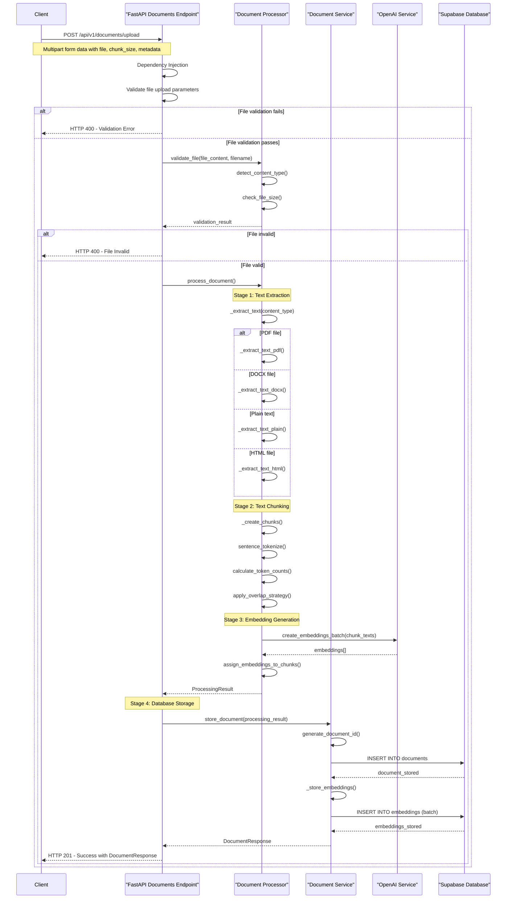
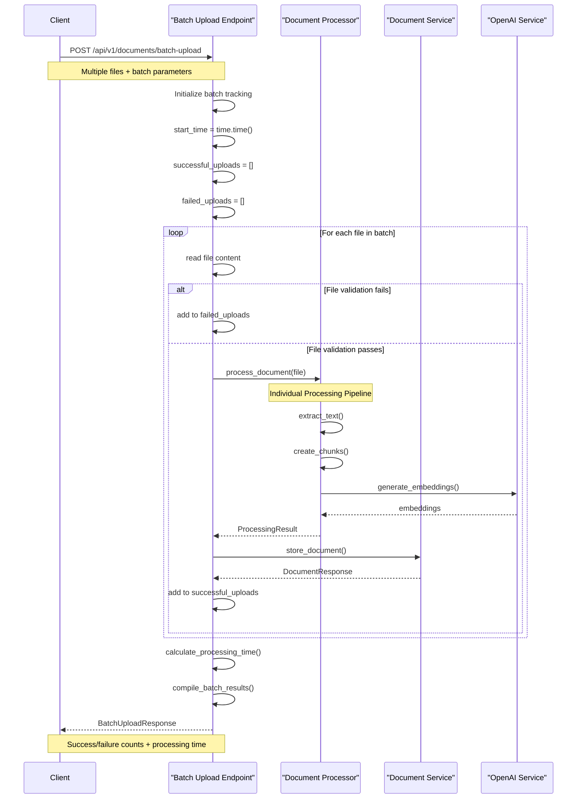
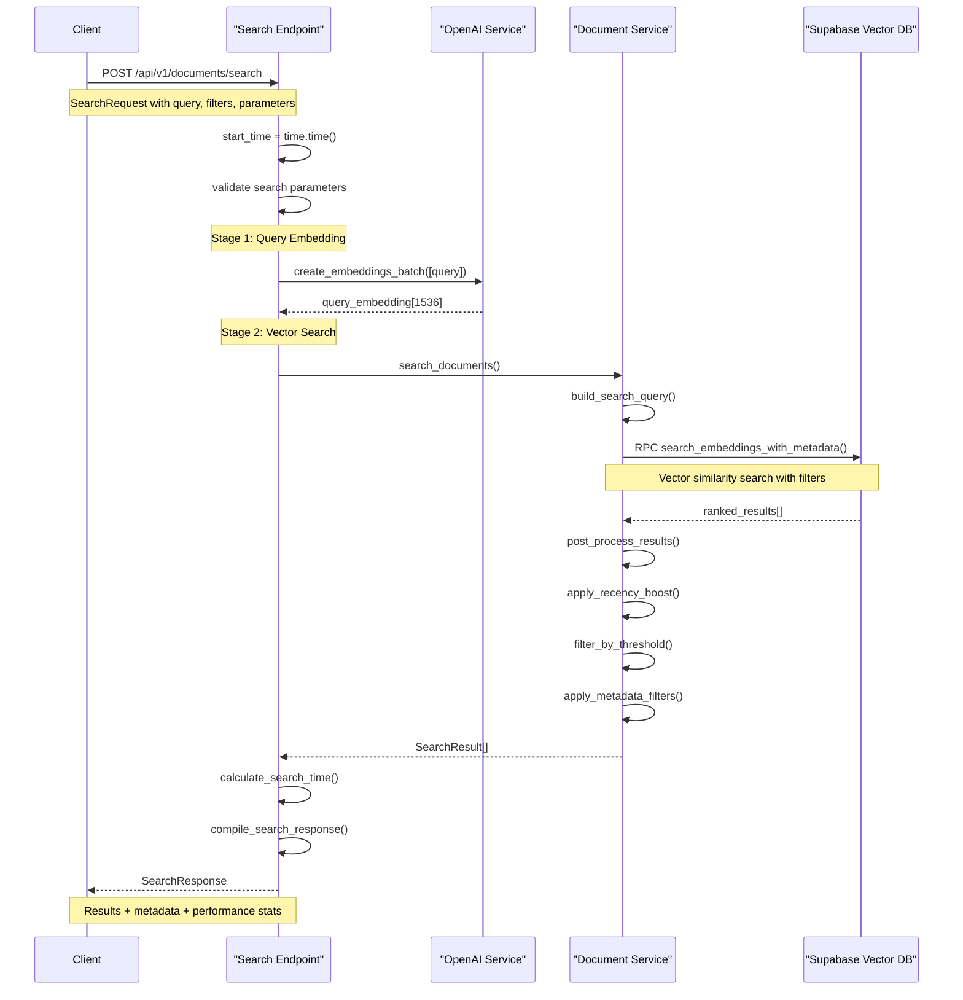
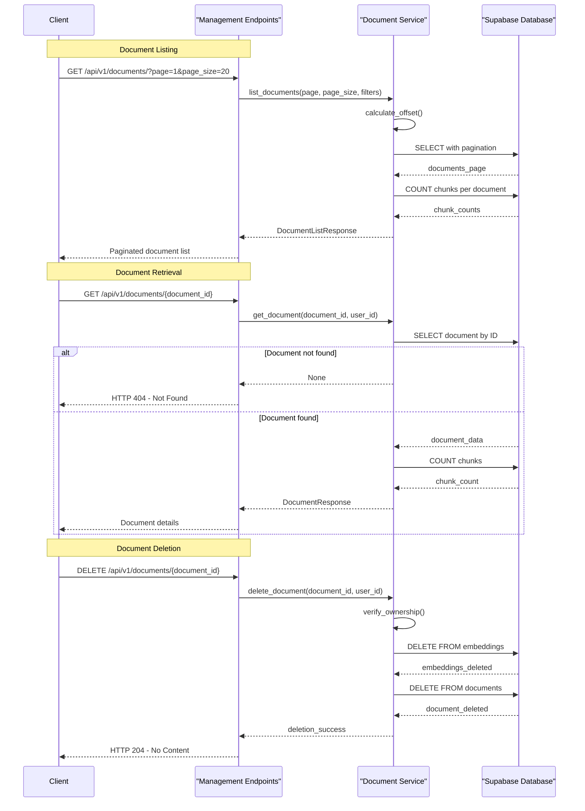
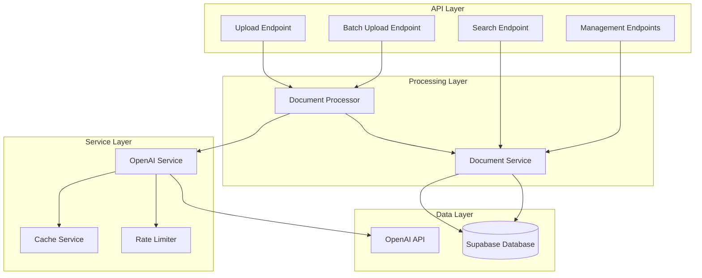
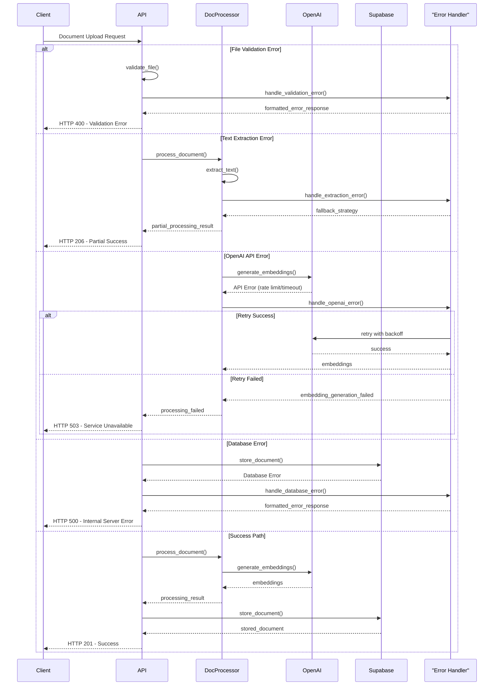
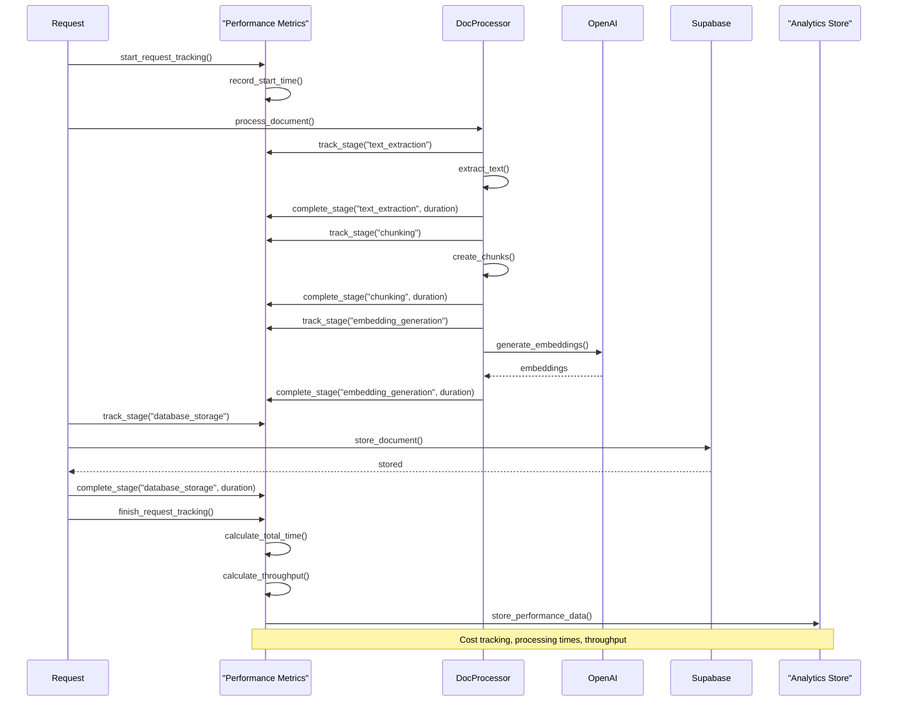
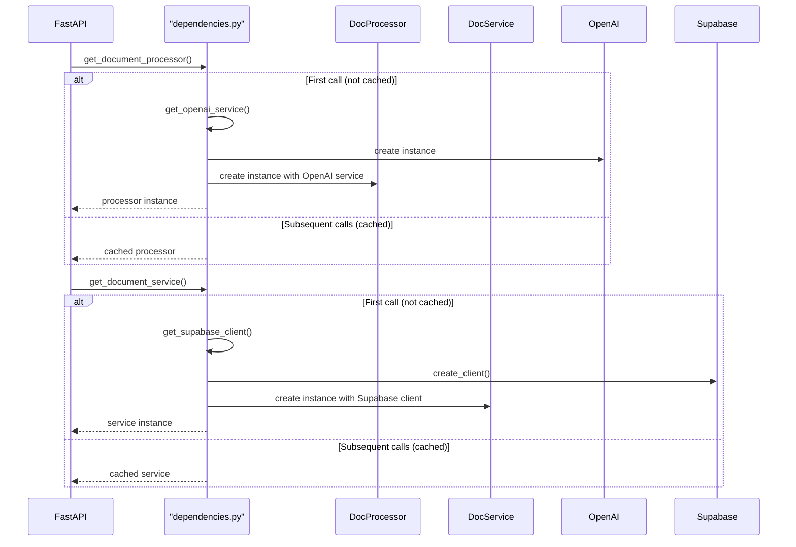

# Document Processing Sequence Diagrams

## 🎯 Overview

This document provides detailed sequence diagrams showing the complete document processing flow from file upload to storage and retrieval. It covers single uploads, batch processing, search operations, and all service interactions.

## 🔄 Complete Document Upload Processing Sequence

The following diagram shows the complete flow of a document upload through the processing pipeline:

## 🔄 Batch Upload Processing Sequence

This diagram shows how multiple documents are processed in a batch operation:

## 🔍 Document Search Sequence

This diagram shows the semantic search process:

## 🗂️ Document Management Operations

This diagram shows CRUD operations for documents:

## 🏗️ Service Integration Overview

This diagram shows how all services integrate in the document processing system:

## 🚨 Error Handling Sequence

This diagram shows error handling throughout the processing pipeline:

## 📊 Performance Monitoring Flow

This diagram shows how performance metrics are collected throughout the processing pipeline:

## 🔄 Dependency Injection Flow

This diagram shows how dependencies are injected and managed:

## 📝 Key Insights from Sequence Diagrams

### Processing Optimization

1. **Batch Processing**: Efficient handling of multiple files with error isolation
2. **Streaming Embeddings**: Batch embedding generation reduces API calls
3. **Database Optimization**: Bulk insert operations for embeddings
4. **Error Recovery**: Graceful degradation with partial processing

### Performance Characteristics

1. **Text Extraction**: Format-specific optimizations reduce processing time
2. **Chunking Strategy**: Sentence-based boundaries improve semantic coherence
3. **Embedding Efficiency**: Batch operations maximize API throughput
4. **Storage Optimization**: Structured data storage with proper indexing

### Error Resilience

1. **Validation Gates**: Multiple validation layers prevent processing failures
2. **Retry Logic**: Exponential backoff for external API failures
3. **Partial Success**: Continue processing when individual files fail
4. **Resource Cleanup**: Proper cleanup on processing failures

### Scalability Features

1. **Async Processing**: Non-blocking operations throughout pipeline
2. **Connection Pooling**: Efficient database connection management
3. **Rate Limiting**: API quota management for external services
4. **Batch Operations**: Reduced overhead for bulk processing

These sequence diagrams provide a comprehensive view of the document processing system's architecture and data flow, enabling developers to understand the complete processing lifecycle and optimization strategies.
