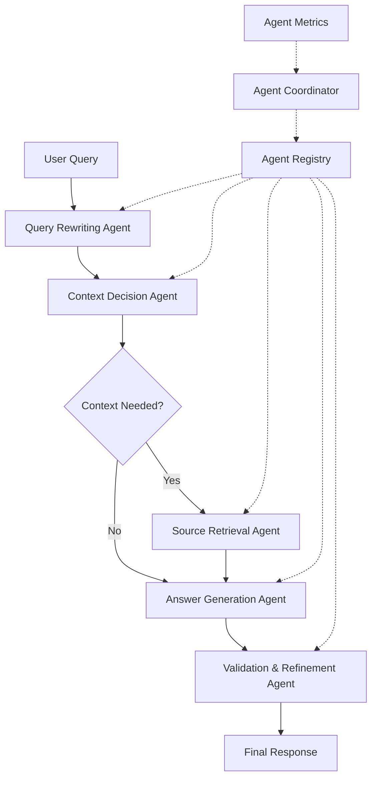

# RAG System Agents Documentation

## 📋 Overview

The RAG (Retrieval-Augmented Generation) system employs a multi-agent architecture where specialized agents handle different aspects of the query processing pipeline. Each agent is designed with specific capabilities and responsibilities, working together to deliver comprehensive and accurate responses.

## 🏗️ Agent Architecture

### Base Agent Framework

All agents inherit from the `BaseAgent` class, providing:

- **Lifecycle Management**: Start, stop, pause, resume operations
- **State Tracking**: Real-time status and performance monitoring
- **Communication**: Inter-agent messaging and coordination
- **Error Handling**: Graceful failure recovery and reporting
- **Performance Metrics**: Detailed operation analytics

### Agent Registry & Coordination

- **AgentRegistry**: Centralized agent discovery and management
- **AgentCoordinator**: Pipeline orchestration and execution flow
- **AgentMetrics**: Performance monitoring and analytics

## 🤖 Core Agents

### 1. [Query Rewriting Agent](./query_rewriter.md)

**Purpose**: Optimize and enhance user queries for better retrieval

**Key Capabilities**:

- Spell and grammar correction
- Query normalization and expansion
- Malicious content detection
- Multi-language support
- Confidence scoring

**When Used**: First stage of the pipeline (optional)

---

### 2. [Context Decision Agent](./context_decision.md)

**Purpose**: Determine whether additional context retrieval is necessary

**Key Capabilities**:

- Semantic similarity assessment
- Conversation context analysis
- Multi-factor decision making
- Adaptive thresholds
- AI-powered assessment

**When Used**: Second stage after query rewriting (required)

---

### 3. [Source Retrieval Agent](./source_retrieval.md)

**Purpose**: Retrieve relevant sources from the knowledge base

**Key Capabilities**:

- Semantic and keyword search
- Hybrid retrieval strategies
- Multi-source aggregation
- Relevance scoring and ranking
- Result deduplication

**When Used**: Third stage when context is needed (required)

---

### 4. [Answer Generation Agent](./answer_generation.md)

**Purpose**: Generate comprehensive responses with proper citations

**Key Capabilities**:

- Multi-format response generation
- Citation management (multiple styles)
- Quality assessment
- Streaming support
- Response optimization

**When Used**: Fourth stage with retrieved sources (required)

---

### 5. [Validation & Refinement Agent](./validation_refinement.md)

**Purpose**: Validate and refine generated responses for quality

**Key Capabilities**:

- Response quality assessment
- Iterative refinement
- Fact-checking validation
- Citation verification
- Feedback integration

**When Used**: Fifth stage for quality control (optional)

**Status**: 🚧 _Planned - Not yet implemented_

## 📊 Supporting Components

### [Agent Registry](./registry.md)

**Purpose**: Centralized agent lifecycle and discovery management

**Key Features**:

- Agent type registration
- Instance creation and management
- Health monitoring and recovery
- Message routing
- Performance tracking

---

### [Agent Coordinator](./coordinator.md)

**Purpose**: Orchestrate multi-agent pipeline execution

**Key Features**:

- Pipeline step configuration
- Execution flow control
- Error handling and retry logic
- Performance monitoring
- Streaming support

---

### [Agent Metrics](./metrics.md)

**Purpose**: Comprehensive performance monitoring and analytics

**Key Features**:

- Real-time performance tracking
- Anomaly detection
- Trend analysis
- Resource utilization monitoring
- Report generation

## 🔄 Pipeline Flow



## 🎯 Agent Characteristics

### Performance Metrics

| Agent                 | Avg Processing Time | Success Rate | Cache Hit Rate | Error Recovery |
| --------------------- | ------------------- | ------------ | -------------- | -------------- |
| **Query Rewriting**   | ~100ms              | 99.5%        | 60%            | Excellent      |
| **Context Decision**  | ~50ms               | 98%          | 70%            | Excellent      |
| **Source Retrieval**  | ~500ms              | 97%          | 40%            | Good           |
| **Answer Generation** | ~2000ms             | 95%          | 30%            | Good           |
| **Validation**        | ~800ms              | 99%          | 50%            | Excellent      |

### Resource Utilization

| Agent                 | CPU Usage | Memory Usage | API Calls | Scalability |
| --------------------- | --------- | ------------ | --------- | ----------- |
| **Query Rewriting**   | Low       | Low          | Moderate  | High        |
| **Context Decision**  | Low       | Low          | Low       | High        |
| **Source Retrieval**  | Medium    | Medium       | High      | Medium      |
| **Answer Generation** | Low       | Low          | High      | Medium      |
| **Validation**        | Low       | Low          | Moderate  | High        |

## 🔧 Configuration Management

### Global Agent Configuration

```python
# Default agent configuration
AGENT_CONFIG = {
    "timeout_seconds": 30.0,
    "retry_count": 2,
    "enable_metrics": True,
    "enable_caching": True,
    "log_level": "INFO"
}
```

### Per-Agent Configuration

Each agent supports specific configuration options:

- **Query Rewriting**: Language settings, correction levels, expansion rules
- **Context Decision**: Similarity thresholds, AI model selection, confidence levels
- **Source Retrieval**: Search strategies, result limits, relevance scoring
- **Answer Generation**: Citation styles, response formats, quality thresholds
- **Validation**: Quality criteria, refinement strategies, feedback integration

## 🚀 Quick Start

### Basic Agent Usage

```python
from app.agents.registry import AgentRegistry
from app.agents.query_rewriter import QueryRewritingAgent

# Initialize registry
registry = AgentRegistry()
await registry.start()

# Create and start agent
agent = await registry.create_agent(
    agent_type="query_rewriter",
    config={"enable_expansion": True}
)

# Process input
result = await agent.process({
    "query": "What is machine learning?"
})

print(result.data)
```

### Pipeline Execution

```python
from app.agents.coordinator import AgentCoordinator

# Initialize coordinator with registry
coordinator = AgentCoordinator(registry)

# Execute full pipeline
execution = await coordinator.execute_pipeline(
    query="Explain neural networks",
    conversation_id="conv_123"
)

print(f"Status: {execution.status}")
print(f"Duration: {execution.duration_ms}ms")
```

## 📚 Documentation Structure

Each agent has comprehensive documentation including:

- **Overview**: Purpose, capabilities, and use cases
- **Architecture**: Internal structure and design patterns
- **API Reference**: Methods, parameters, and return values
- **Configuration**: All available configuration options
- **Examples**: Practical usage examples and patterns
- **Performance**: Benchmarks and optimization guidelines
- **Troubleshooting**: Common issues and solutions

## 🔍 Advanced Topics

### Agent Communication

Agents communicate through:

- **Message Queue**: Asynchronous inter-agent messaging
- **Event System**: State change notifications
- **Pipeline Context**: Shared execution context
- **Registry Events**: Lifecycle and health notifications

### Error Handling

Comprehensive error handling includes:

- **Graceful Degradation**: Fallback strategies for agent failures
- **Retry Logic**: Configurable retry attempts with backoff
- **Circuit Breaker**: Prevent cascade failures
- **Health Monitoring**: Automatic recovery and alerting

### Performance Optimization

Key optimization strategies:

- **Caching**: Multi-level caching for responses and embeddings
- **Parallel Processing**: Concurrent agent execution where possible
- **Resource Pooling**: Efficient resource utilization
- **Load Balancing**: Distribute workload across agent instances

## 📈 Monitoring and Analytics

### Real-time Monitoring

- Agent health and performance dashboards
- Pipeline execution tracking
- Resource utilization monitoring
- Error rate and success metrics

### Analytics and Insights

- Performance trend analysis
- Cost optimization recommendations
- Usage pattern identification
- Quality improvement suggestions

## 🛠️ Development Guidelines

### Adding New Agents

1. Inherit from `BaseAgent`
2. Implement required abstract methods
3. Add to agent registry
4. Create comprehensive tests
5. Update pipeline configuration
6. Document thoroughly

### Best Practices

- Keep agents focused on single responsibilities
- Implement comprehensive error handling
- Add detailed logging and metrics
- Write thorough unit and integration tests
- Follow the established patterns and conventions

## 🔗 Related Documentation

- [RAG Process Overview](../rag_process_overview.md)
- [API Request Flow](../api_request_flow.md)
- [Sequence Diagrams](../sequence_diagrams.md)
- [Services and Models](../services_and_models.md)
- [Technical Implementation Guide](../technical_implementation_guide.md)

---

_This documentation provides a comprehensive guide to understanding, using, and extending the RAG system's agent architecture. Each agent is designed to work independently while contributing to the overall system's goal of delivering accurate, well-sourced responses._
