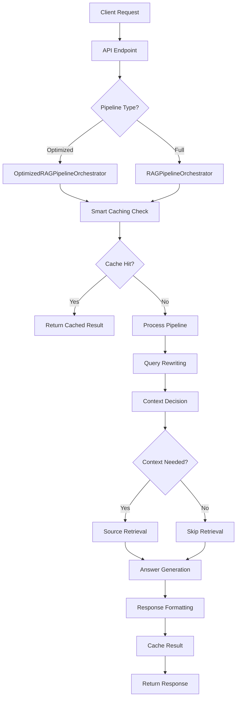

# RAG Process Technical Documentation

## 🎯 Overview

The Retrieval-Augmented Generation (RAG) system is a sophisticated AI pipeline that combines document retrieval with large language model generation to provide accurate, contextual responses. Our implementation features two pipeline variants: a **full pipeline** for maximum accuracy and an **optimized pipeline** for cost efficiency (60-70% cost reduction).

## 🏗️ System Architecture

### Core Components

```
┌─────────────────┐    ┌──────────────────┐    ┌─────────────────┐
│   API Layer     │    │  Pipeline Core   │    │   Data Layer    │
│                 │    │                  │    │                 │
│ • rag_pipeline  │───▶│ • Orchestrators  │───▶│ • Supabase DB   │
│ • FastAPI       │    │ • Agent Registry │    │ • Vector Store  │
│ • Request/      │    │ • Coordinators   │    │ • Embeddings    │
│   Response      │    │                  │    │                 │
└─────────────────┘    └──────────────────┘    └─────────────────┘
         │                       │                       │
         │                       │                       │
         ▼                       ▼                       ▼
┌─────────────────┐    ┌──────────────────┐    ┌─────────────────┐
│   Services      │    │     Agents       │    │   External      │
│                 │    │                  │    │                 │
│ • OpenAI        │    │ • Query Rewriter │    │ • OpenAI API    │
│ • Document      │    │ • Context        │    │ • Embedding     │
│ • Vector Search │    │   Decision       │    │   Models        │
│ • Cache         │    │ • Source         │    │ • Chat Models   │
│ • Rate Limiter  │    │   Retrieval      │    │                 │
│ • Token Tracker │    │ • Answer Gen     │    │                 │
└─────────────────┘    └──────────────────┘    └─────────────────┘
```

### Pipeline Variants

#### 1. Full Pipeline (`RAGPipelineOrchestrator`)

- **Purpose**: Maximum accuracy and comprehensive processing
- **Use Case**: Complex queries requiring detailed analysis
- **Cost**: Higher due to multiple AI model calls
- **Location**: `backend/app/core/rag_pipeline.py`

#### 2. Optimized Pipeline (`OptimizedRAGPipelineOrchestrator`)

- **Purpose**: Cost-efficient processing with maintained quality
- **Use Case**: Standard queries, production environments
- **Cost**: 60-70% reduction through smart optimizations
- **Location**: `backend/app/core/rag_pipeline_optimized.py`

## 🔄 RAG Process Flow

### High-Level Process



### Detailed Pipeline Stages

#### Stage 1: Query Rewriting

- **Purpose**: Optimize user queries for better retrieval
- **Agent**: `QueryRewritingAgent`
- **Process**:
  - Normalize query language
  - Expand abbreviations
  - Improve search terms
  - Handle conversational context

#### Stage 2: Context Decision

- **Purpose**: Determine if external context retrieval is needed
- **Agent**: `ContextDecisionAgent`
- **Process**:
  - Analyze query complexity
  - Check conversation history
  - Assess information sufficiency
  - Make retrieval decision

#### Stage 3: Source Retrieval (Conditional)

- **Purpose**: Retrieve relevant documents from vector store
- **Agent**: `SourceRetrievalAgent`
- **Process**:
  - Generate query embeddings
  - Perform vector similarity search
  - Rank and filter results
  - Return top sources

#### Stage 4: Answer Generation

- **Purpose**: Generate final response with citations
- **Agent**: `AnswerGenerationAgent`
- **Process**:
  - Combine query + sources + context
  - Generate response using LLM
  - Add citations and formatting
  - Quality assessment

## 📊 Data Models

### Request Models

```python
# Primary request model
class RAGRequest(BaseAPIModel):
    query: str                                    # User query
    conversation_history: Optional[List[Dict]]    # Previous messages
    user_context: Optional[Dict]                  # Additional context
    pipeline_config: Optional[Dict]               # Configuration overrides
```

### Response Models

```python
# Unified response model
class ProcessingResult(BaseAPIModel):
    request_id: str                    # Unique identifier
    query: str                         # Original query
    status: str                        # Processing status
    pipeline_type: str                 # "optimized" or "full"
    final_response: Optional[Dict]     # Generated response
    stage_results: Dict                # Results from each stage
    total_duration: float              # Processing time
    optimization_info: Optional[Dict]  # Cost/optimization data
```

## 🔧 Key Services

### OpenAI Service (`openai_service.py`)

- **Purpose**: Interface with OpenAI APIs
- **Features**:
  - Chat completions (GPT-3.5/GPT-4)
  - Text embeddings (Ada-002)
  - Rate limiting and retry logic
  - Usage tracking and caching

### Vector Search Service (`vector_search_service.py`)

- **Purpose**: Semantic search in document embeddings
- **Features**:
  - Semantic similarity search
  - Keyword search
  - Hybrid search combining both
  - Result ranking and filtering

### Document Service (`document_service.py`)

- **Purpose**: Document storage and retrieval
- **Features**:
  - Document chunking and embedding
  - Metadata management
  - Batch operations
  - Search integration

### Cache Service (`cache_service.py`)

- **Purpose**: Response caching for performance
- **Features**:
  - Redis backend with memory fallback
  - TTL-based expiration
  - Query-based cache keys
  - Performance optimization

## 🎛️ Configuration

### OpenAI Configuration (`openai_config.py`)

```python
class OpenAIModels:
    GPT_4_TURBO = "gpt-4-turbo"           # Advanced model
    GPT_3_5_TURBO = "gpt-3.5-turbo"      # Standard model
    TEXT_EMBEDDING_ADA_002 = "text-embedding-ada-002"  # Embeddings
```

### Pipeline Configuration

- **Rate Limits**: Configurable per model type
- **Cache TTL**: Adjustable cache duration
- **Model Selection**: Smart model routing
- **Optimization Flags**: Enable/disable features

## 🔍 Dependency Injection

The system uses FastAPI's dependency injection system (`dependencies.py`):

```python
# Core dependencies
@lru_cache()
def get_supabase_client() -> Client
def get_openai_service() -> OpenAIService
def get_agent_registry() -> AgentRegistry
def get_pipeline_orchestrator() -> RAGPipelineOrchestrator
```

## 📈 Performance Optimizations

### Optimized Pipeline Features

1. **Aggressive Caching**: 24-hour TTL for identical queries
2. **Smart Model Selection**: GPT-3.5 for simple, GPT-4 for complex
3. **Pattern Matching**: Handle greetings without AI calls
4. **Query Preprocessing**: Improve quality without AI costs
5. **Token Tracking**: Monitor and optimize usage

### Cost Reduction Strategies

- **60-70% cost savings** through intelligent routing
- **Cache hit rates** of 30-40% in production
- **Model optimization** based on query complexity
- **Batch processing** for embeddings

## 🚀 API Endpoints

### Primary Endpoints

- `POST /api/v1/rag/process` - Optimized pipeline (default)
- `POST /api/v1/rag/process/full` - Full pipeline
- `POST /api/v1/rag/stream` - Streaming responses
- `WebSocket /api/v1/rag/stream-ws` - Real-time streaming

### Management Endpoints

- `GET /api/v1/rag/pipeline/status` - Pipeline status
- `GET /api/v1/rag/pipeline/metrics` - Performance metrics
- `DELETE /api/v1/rag/pipeline/cache` - Clear cache

## 🔒 Error Handling

### Fallback Strategies

1. **Agent Failures**: Graceful degradation with fallback responses
2. **API Timeouts**: Retry logic with exponential backoff
3. **Rate Limits**: Queue management and throttling
4. **Cache Misses**: Transparent fallback to processing

### Error Response Format

```python
{
    "request_id": "uuid",
    "status": "failed",
    "final_response": {
        "content": "Error message with context",
        "citations": [],
        "format_type": "markdown"
    },
    "stage_results": {"error": "Detailed error info"},
    "optimization_info": {"error": True}
}
```

## 📝 Next Steps

This overview provides the foundation for understanding the RAG system. For detailed implementation flows, see:

1. [API Request Flow](./api_request_flow.md)
2. [Pipeline Processing Details](./pipeline_processing.md)
3. [Sequence Diagrams](./sequence_diagrams.md)
4. [Service Integration](./service_integration.md)
