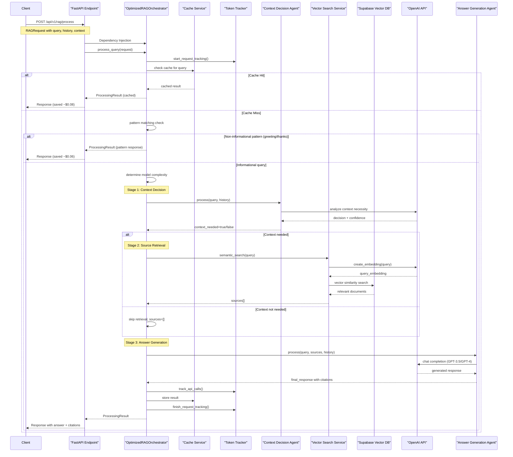
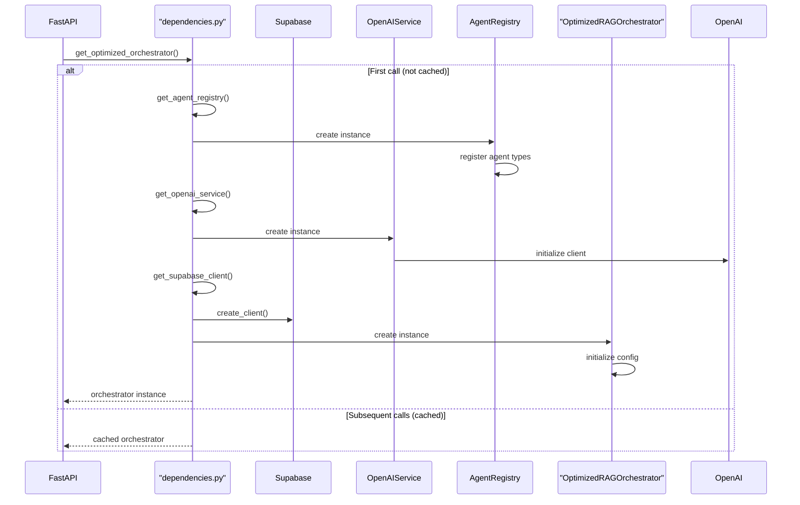
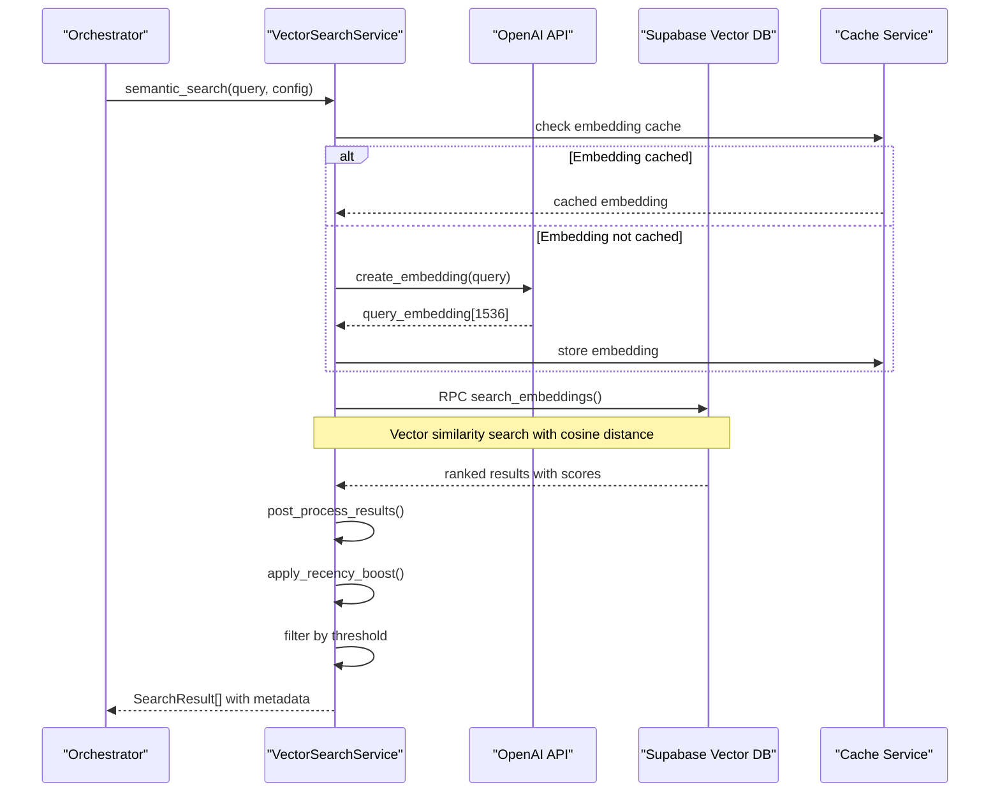
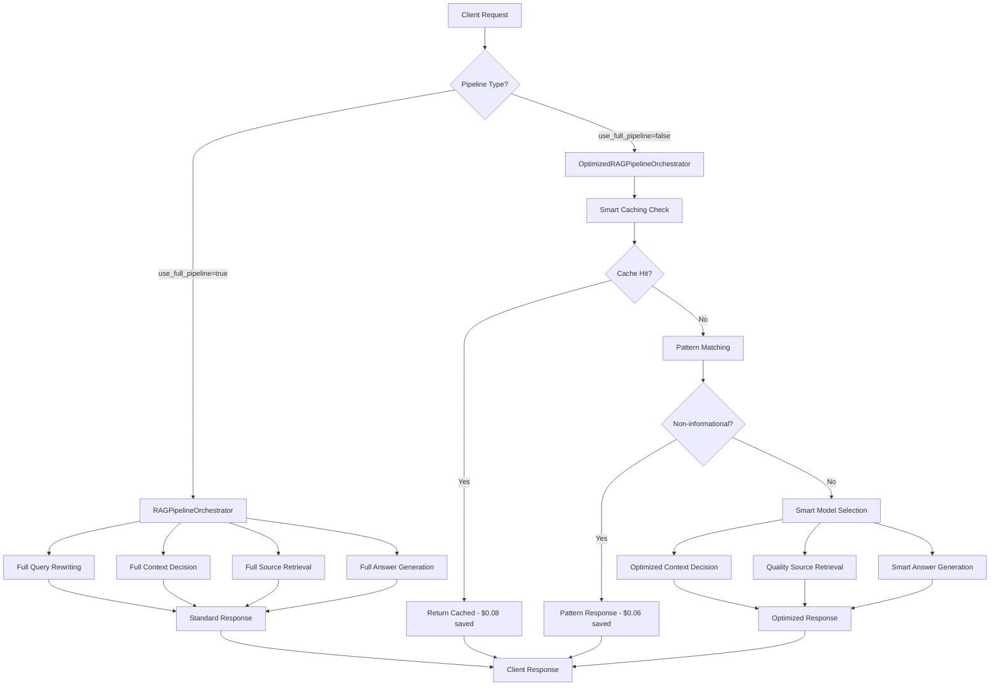
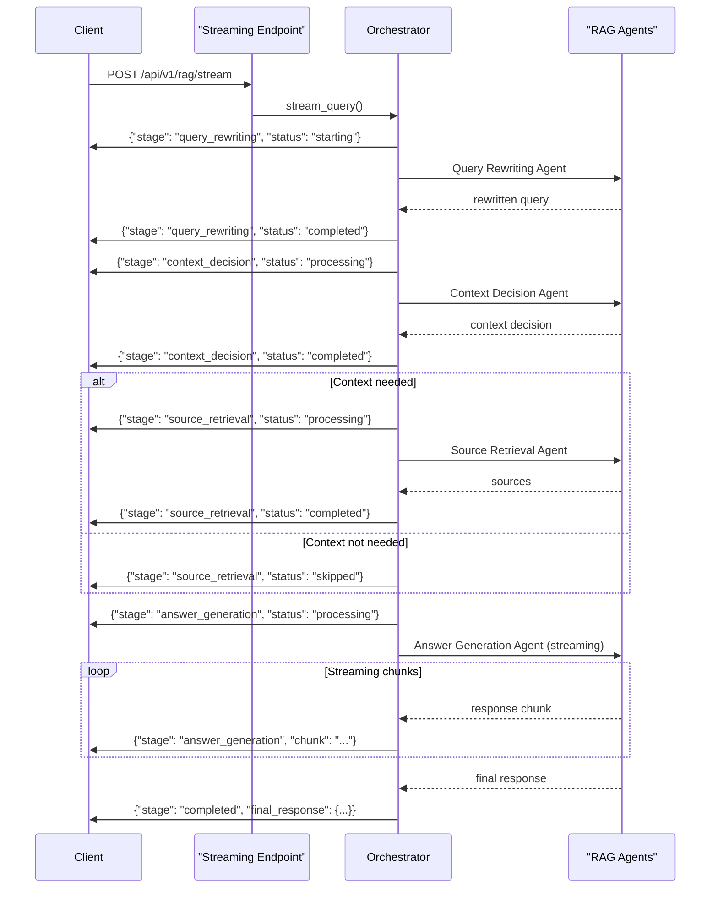
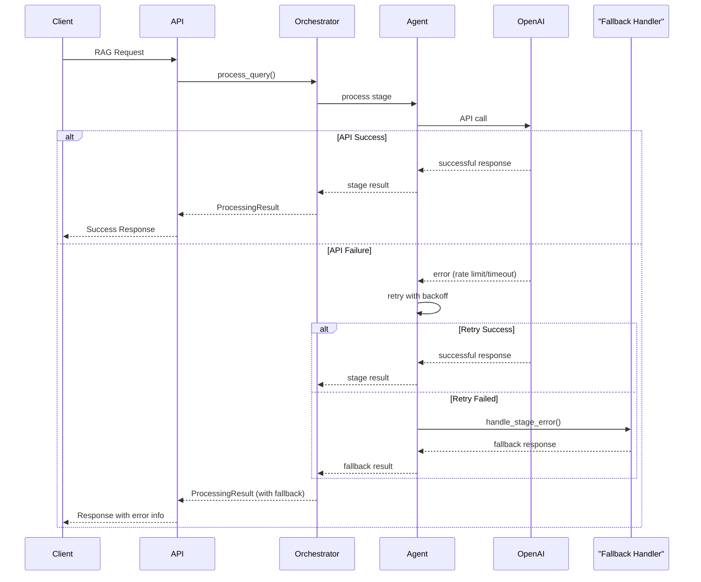
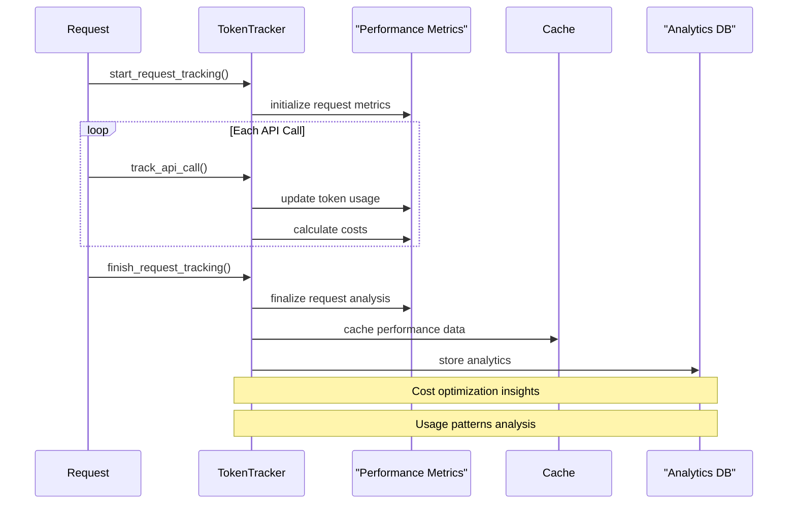
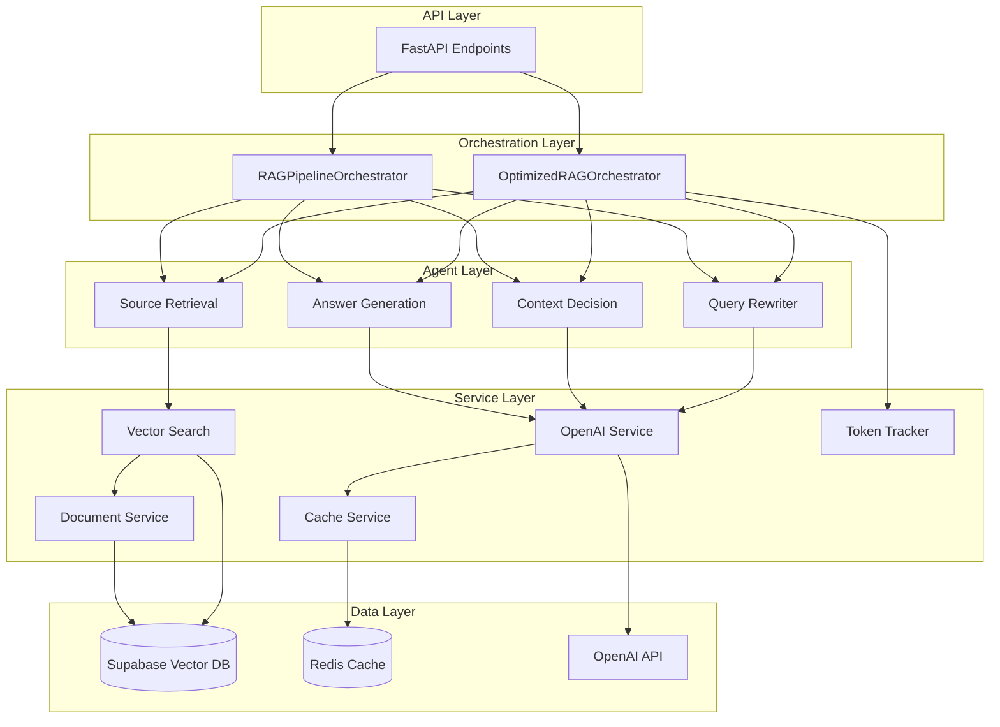

# RAG Process Sequence Diagrams

## 🎯 Overview

This document provides detailed sequence diagrams showing the complete RAG process flow from API request to final response. It covers both optimized and full pipeline variants, including all service interactions and data flows.

## 🔄 Complete RAG Process Sequence Diagram

The following diagram shows the complete flow of a RAG request through the optimized pipeline:

## 🏗️ Dependency Injection Flow

This diagram shows how dependencies are injected and initialized:

## 🔍 Vector Search Detail Flow

This diagram focuses on the vector search process within source retrieval:

## 📊 Full Pipeline vs Optimized Pipeline

This diagram compares the two pipeline variants:

## 🔄 Streaming Response Flow

This diagram shows the streaming endpoint behavior:

## 🚨 Error Handling Flow

This diagram shows error handling and fallback mechanisms:

## 📈 Performance Monitoring Flow

This diagram shows how performance metrics are collected:

## 🔧 Service Integration Overview

This diagram shows how all services integrate:

## 📝 Key Insights from Sequence Diagrams

### Performance Optimizations

1. **Caching Strategy**: Multiple cache layers reduce API calls
2. **Pattern Matching**: Handles simple queries without AI processing
3. **Smart Model Selection**: Uses appropriate model for query complexity
4. **Dependency Injection**: Efficient resource management

### Cost Reduction Mechanisms

1. **Aggressive Caching**: 24-hour TTL saves ~$0.08 per cache hit
2. **Pattern Responses**: Non-informational queries save ~$0.06
3. **Model Optimization**: GPT-3.5 vs GPT-4 selection
4. **Token Tracking**: Real-time cost monitoring

### Error Resilience

1. **Retry Logic**: Exponential backoff for API failures
2. **Fallback Responses**: Graceful degradation
3. **Stage Isolation**: Failures don't cascade
4. **Monitoring**: Comprehensive error tracking

### Scalability Features

1. **Async Processing**: Non-blocking operations
2. **Connection Pooling**: Efficient database connections
3. **Rate Limiting**: API quota management
4. **Streaming Support**: Real-time responses

These sequence diagrams provide a comprehensive view of the RAG system's architecture and data flow, enabling developers to understand the complete request lifecycle and optimization strategies.
